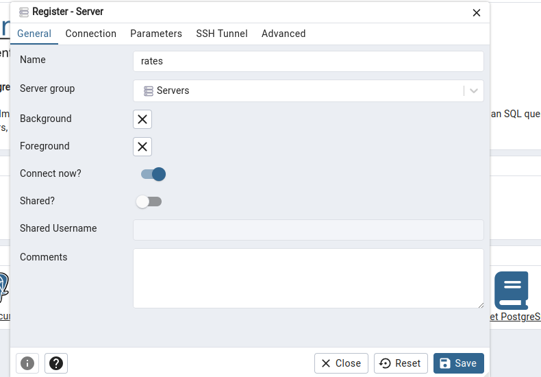
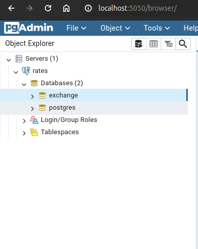

# Exchange Rate

### Architecture


### Project Structure

    .
    ├── ...
    ├── ingest/                 
    │   ├── Dockerfile         
    │   ├── extract_rste_data.py
    │   └── requirements.txt          
    ├── pnl/
    │   ├── Dockerfile         
    │   ├── hourly_pnl.py
    │   └── requirements.txt          
    ├── docker-compose.yaml                  
    ├── README.md         
    ├── .gitignore
    ├── .env.template

#### Ingestion

The ingest folder holds the ingestion script, this script extracts the exchange rate data from the coingecko api and stores the result in a postgresdb.

Note: Because I am using the free demo coingecko api, I do get an `error 429`.

for example `ERROR - Failed to fetch data for tether. Status code: 429` because it's being rate limited.


#### Pnl Calculation

The PnL folder contains a file named hourly_pnl.py, this file 
- loads the exchange rate data from the db
- extract a wallet balance from the allium api.
- calculates the hourly wallet pnl.
- send the hourly pnl result to the db.


### Setting up the Project

#### Environment Variables
Create a `.env` file in the root directory or simply rename the `.env.template` to `.env`. I have prepopulated the template with some of the values i used to test the setup.

```
POSTGRES_USER=
POSTGRES_PW=
POSTGRES_DB=
POSTGRES_PORT=
PGADMIN_MAIL=
PGADMIN_PW=
INSTANCE_HOST=
X_API_KEY=
WALLET_ADDRESS=
TABLE_NAME=
```

Replace the variables with your environment variables.

`INSTANCE_HOST=postgres` - because that's the name of the db service in the docker-compose file.

After editing the .env file, run `source .env` this will set the environemntal variables so the docker command can read them.

To see your docker config run and make sure everything is set as you like it.

`docker compose config`

#### Build the docker container

`docker compose build`

#### Run the docker containers

`docker compose up`

When you run this command, the postgres db is automatically created using the name you provide in the `POSTGRES_DB` variable in env file.


#### PG Admin

You can use pgadmin tool to visually look through your db and tables.

Steps to setup pgadmin once the docker image is up.

1. go the the link `http://localhost:5050/`, you will be required to login with the `PGADMIN_MAIL` and `PGADMIN_PW` you specified in the env file.

2. Right click on `server` then hover over `register` and click on `server` to setup your pg server.


3. on the register server tab, specify a name in the name column.


4. Click on connections 
- hostname should be the name of the postgres db service or `INSTANCE_HOST` variable
- add your user name and password as specified in the env variable.
- leave maintainance db as it is.
- Click on save and your server should load.


5. Once the server has loaded, you should be greeted with a screen similar to the image below. Click on your db name, then click on schema and lastly tables. You should now see the tables containing the exchange rate data and pnl calculations.


