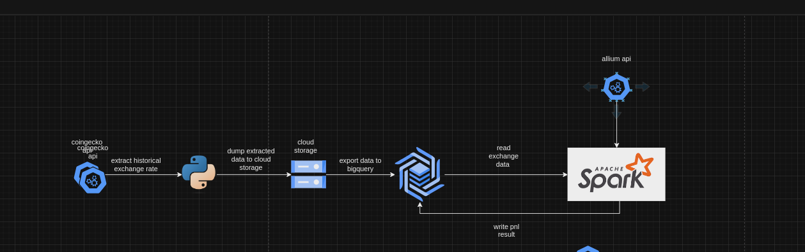
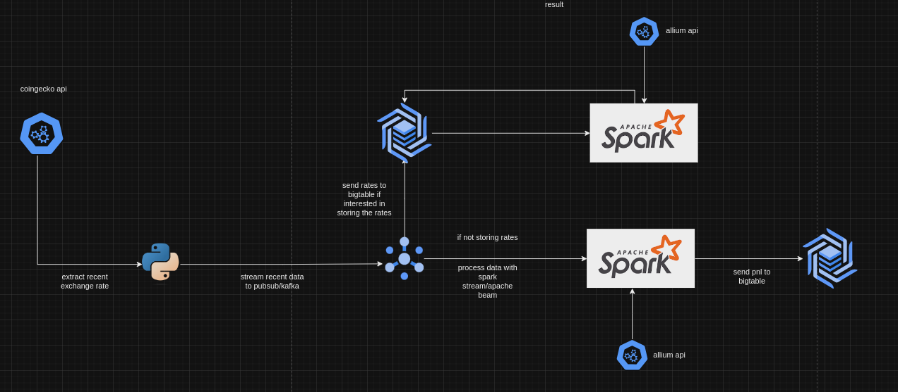

# Part 4 Answer

Current prototype setup can be found in the README

### Automating the prototype setup.
There’s currently no automation in this setup. But if i were to introduce some level of automation to this setup, I will use an architecture similar to this.

1. Setup 2 cloud functions, one to run the exchange rate extraction script, and the other to run the hourly pnl script.
2. A cloud sql storage - This will be the persistent storage where the exchange rate data will be stored.
3. A cloud scheduler to trigger the extraction function every hour.

### New scaling requirement
1. Include 10000 tokens 
2. Calculate PnL with 5 minute granularity (instead of hourly) 
3. Show PnLs up to the start of the coins (e.g. 2009 for Bitcoin, 2015 for Ethereum), instead of just the past week.

These new scaling requirement suggest
1. An increase in the number of tokens to extract exchange rate data.
2. 5 minutes granularity suggests a near real time pnl calculation.

On the high level, This consist of following 2 approaches - the lambda architecture
1. A batch system to extract and process the historical exchange rate data for the 10000 tokens with 5 minutes granularity. 
2. A real time system that extracts the current exchange rate data and processes this new data.

Lambda scaling architecture diagram

### Architecture overview for the batch system
1. Use and parallelize batch requests to the api to extract historical rate data for the tokens in parquet or avro format.
2. Dump the extracted data in a cloud storage location.
3. Import extracted data from cloud storage into a bigtable.
4. Process the extracted data with spark/apache beam and write the pnl result back to bigtable.

### Storage
Cloud storage: The extracted data will be stored in a file format and cloud storage offers a great way to store this kind of file.
Bigtable is used because our system requires a database solution that can handle the operational load and also provides scalability, automation, low latency for the kind of pnl calculation we want to perform.

### Ingestion
Since the system will be extracting and ingesting a huge volume of data, here are some steps that can help handle this process faster.
Use Parallelize batch request: run python async requests to handle the batch request, e.g In this case where 10000 tokens is involved, running a batch request to extract data for 100 tokens or 1000 tokens per batch might help. Making sure to avoid hitting the rate limit of the api we are extracting the data from.

### Data processing:
To calculate the PnL, we can use apache spark or apache beam to perform this computation because this are big data processing tools that can handle the scale of the data we are working with.

### Architecture overview for the streaming pipeline
1. Use parallelize batch requests to extract the data from the api.
2. Stream data into a distributed service like apache kafka/gcp pubsub.
3. Extract data from kafka/pubsub to bigtable(if the rates need to be stored), can also consider google firestore.
4. Use spark streaming or apache beam to calculate the pnl with 5 minutes granularity.
5. Send the pnl result back to bigtable.

### Infrastructure
Cloud infrastructure - This service can be deployed on GCP or AWS using terraform as the iac tool.